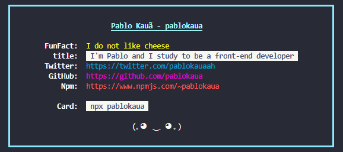

<h1 align="center">
    
</h1>

# 💻 Estartando Devs:
O Estartando Devs é um projeto social e tem como objetivo transformar o mundo através da educação e tecnologia.
[Estartando Devs](https://www.estartandodevs.com.br/)


## 📜 Sobre
Desenvolver um projeto [npm](https://www.npmjs.com/) que sirva de cartão de visitas.

---

## 🚀 Tecnologias:
* Javascript
* Git e Github
* Npm

---

## 👁 Veja o resultado do projeto

<h1 align="center">
    
</h1>

Digite os seguintes comandos no seu terminal
```bash
    $ npm init -y
    # Será criado um arquivo package.json
    $ npm pablokaua
    # O cartão com as informações será mostrado
```

### Resultado:
<h1 align="center">
    
</h1>

## 👥 Clone o projeto:
```bash
    # Digite o seguinte comando no bash:
    $ git clone https://github.com/pablokaua/pablokaua_npx_card.git
```